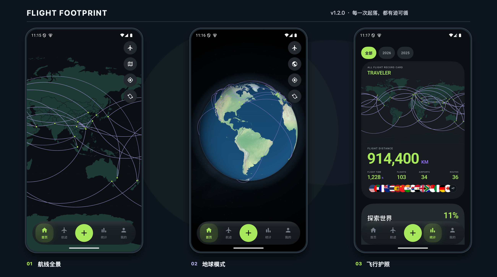

# 航迹 · Flight Footprint

一个独立、离线、本地优先的 Flutter 飞行记录应用。Android 最新版为 `1.2.0`；记录保存在设备内，无需登录。云同步是可选的自建能力，版本检查需要联网。



*Android 模拟器实拍 · 深色主题*

## 主要功能

- 飞行地图与旅行足迹切换；平面地图支持缩放、拖动、点选和定位，地球模式支持真实昼夜、旋转与航线动画
- 旅行足迹按国家 / 地区与中国行政区统计；平面地图点亮已到访板块，地球模式显示足迹点
- 航班记录支持年份筛选、搜索、编辑、删除，以及机场和航班信息自动补全
- 统计总里程、飞行时间、航班、机场、航线、机型、航司、城市与国家 / 地区，并生成可保存或分享的飞行护照卡
- SQLite 本地数据存储
- JSON 备份导出与恢复导入（兼容网页版导出记录）
- 中文 / English 全局切换
- 「我的」页面提供版本检查；Android 可下载新版 APK，macOS 可下载并打开 DMG
- 航空公司与航班号必填，可选通过 ADSBdb / FlightBoard 兼容路线源自动补全
- 可选连接自建 Cloudflare Worker + D1，支持本地覆盖云端与云端恢复到本地
- macOS 桌面端采用侧栏 + 工作区布局，适配大屏窗口
- 深色 / 浅色主题、中文 / English 与本地优先数据策略

## 下载

<table>
  <tr>
    <td width="50%" valign="top">
      <h3>Android</h3>
      <p>APK · v1.2.0 · 本地优先</p>
      <a href="https://github.com/yiming-space/flight-footprint/releases/download/v1.2.0/app-release.apk">
        
      </a>
    </td>
    <td width="50%" valign="top">
      <h3>macOS</h3>
      <p>DMG · v1.1.5 · 桌面端双栏布局</p>
      <a href="https://github.com/yiming-space/flight-footprint/releases/download/v1.1.5/flight_footprint-macos-v1.1.5.dmg">
        
      </a>
    </td>
  </tr>
</table>

<p>
  <a href="https://github.com/yiming-space/flight-footprint/releases">
    
  </a>
</p>

macOS 安装包为当前开发分发版，未进行 Apple Developer 签名与公证。首次打开若被 Gatekeeper 拦截，请在 Finder 中右键 App 选择「打开」，或到「系统设置 → 隐私与安全性」允许打开。App 内检查更新会根据平台选择 APK 或 DMG；macOS 下载完成后会打开 DMG，由用户将 App 拖入「应用程序」完成替换。

## 本地运行

```bash
flutter pub get
flutter test
flutter run
```

## 数据原则

- SQLite 是设备内唯一真实数据源。
- 地图、机场坐标和行政区数据均随安装包离线提供。
- 机场索引由 [OurAirports 公共机场数据](https://ourairports.com/data/) 生成，保留 IATA、ICAO、正式名、行政城市、机场类型、定期航班标记和别名；生成脚本为 `tool/generate_airport_index.py`。
- 索引保留上一个版本中已移除的 IATA 别名，避免历史记录因数据源更新而失去坐标。
- 1.2.0 的核心记录功能不要求账号、配对码或网络；进入「我的」页面检查更新及手动检查时需要联网。
- 未连接云端时完全离线可用；连接云端也不会改变 SQLite 本地数据源。

## 可选云端同步

云端同步使用你自己部署的 Cloudflare Worker + D1，飞行记录和旅行足迹由你的 Cloudflare 账号管理。

### 快速搭建

1. 准备 Cloudflare 账号，部署配套的 Worker + D1 模板。
2. 部署时设置 `BOOTSTRAP_SECRET`，建议用密码管理器生成不少于 32 个字符的随机字符串。
3. 部署完成后复制 Worker 地址，稍后填入 App。

### App 使用

1. 打开「我的 → 云端同步」，首次选择「新建云端」，输入 Worker 地址和初始化密钥。
2. App 创建资料库并显示一次恢复码，请立即离线保存。
3. 其他设备选择「恢复已有云端」，输入同一个 Worker 地址和恢复码即可配对。
4. 「本地覆盖云端」上传本机的飞行记录和旅行足迹；「云端恢复到本地」下载云端数据。
5. 当前为手动同步，使用前后按需操作；未配置云端时 App 仍可离线使用。

安全提示：初始化密钥、恢复码和设备令牌只应由自己保存，不要上传到公开仓库或放进截图。云端只保存飞行记录（含航迹点）和旅行足迹，统计数据会在设备本地重新计算。

## 致谢

本项目参考并使用了以下开源项目与公开数据：

- [Flutter](https://flutter.dev/)：应用开发框架。
- [PaddleOCR](https://github.com/PaddlePaddle/PaddleOCR)：本地图片文字识别能力，遵循 Apache-2.0 许可。
- [ONNX Runtime](https://github.com/microsoft/onnxruntime)：本地模型推理，遵循 MIT 许可。
- [OpenCV](https://opencv.org/)：图像预处理，遵循 Apache-2.0 许可。
- [flag-icons](https://github.com/lipis/flag-icons)：国家和地区旗帜素材，遵循 MIT 许可；许可文本见 `assets/flags/FLAG-ICONS-LICENSE`。
- [Natural Earth](https://www.naturalearthdata.com/)：世界地图数据，公共领域。
- [OurAirports](https://ourairports.com/data/)：机场索引数据，公共领域。

产品交互与视觉方向参考过 Flighty 等飞行记录产品，仅作为设计参考，不包含其代码或素材。
